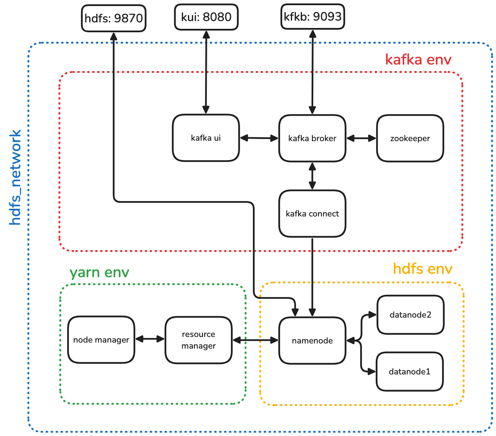

# 02 - Amazon Sales Data Ingest with Kafka and HDFS

By Adrián Romero Flores. Source code available at this [link](https://github.com/adrrf/bigdata/tree/main/02-kafka-hdfs).

## Overview

1. [Introduction](#introduction)
2. [Setup and Configuration](#setup-and-configuration)
3. [Pipeline](#pipeline)
4. [Producer and Consumer](#producer-and-consumer)
5. [Results and Conclusions](#results-and-conclusions)

---

## Introduction

This project focuses on building a data ingestion pipeline for Amazon sales data using Apache Kafka and Hadoop HDFS. The pipeline ingests structured sales data through Kafka, and subsequently persists it into HDFS using Kafka Connect with an HDFS Sink connector.

The document structure is as follows, in section Setup and Configuration we will talk about the infrastructure setup and configuration. In section Pipeline we will describe the data pipeline architecture. In section Producer and Consumer we will describe the producer and consumer applications, in this case the consumer will be a connection of Kafka Connect. In section Results and Conclusions we will present the results and conclusions.

## Setup and Configuration

We have used the sample code provided in [S3 - Kafka](https://github.com/josemarialuna/ing-datos-big-data-US), and no major modifications were applied to the base setup.

The system is deployed on a single virtual network named hdfs_network, enabling uninterrupted communication between all services.

The architecture is composed of three main environments:

- Kafka Environment: This layer handles the message streaming functionality. The core component is the Kafka broker, which manages the reception and distribution of messages. Kafka is orchestrated by ZooKeeper and integrated with Kafka Connect, which serves as a bridge to external systems such as HDFS. Additionally, a Kafka UI tool is included to facilitate monitoring of topics and messages.

- HDFS Environment:
  This layer is responsible for distributed data storage. The main component is the NameNode, which manages the filesystem namespace and coordinates the two DataNodes where data blocks are physically stored. A web-based HDFS UI is also provided for file browsing and inspection.

- YARN Environment:
  This layer manages cluster resource allocation and job scheduling. The ResourceManager is the central component, responsible for assigning resources to running applications. It operates in conjunction with a NodeManager, which handle task execution on the worker nodes.



To get up the Kafka environment, follow these steps:

1. Clone the repository:

   ```
   git clone https://github.com/josemarialuna/ing-datos-big-data-US.git
   ```

2. Navigate to the Kafka environment directory:

   ```
   cd ing-datos-big-data-US/02-kafka-hdfs/kafka
   ```

3. Start the Kafka environment:
   ```
   docker-compose up -d
   ```

## Pipeline

The diagram below illustrates the architecture of the data ingestion pipeline used in this project:


1. amazonsales.csv: A structured CSV file containing Amazon sales records that serves as the source dataset to be ingested.

2. producer.py: A Python script responsible for reading rows from the `amazonsales.csv` file. Each row is parsed as JSON and published as an individual message to a Kafka topic. Uses the Kafka client library `confluent-kafka` to interact with Kafka.

3. Kafka: Receives the messages from the producer and retains them until they are consumed by downstream components.

4. Kafka Connect: It employs an HDFS Sink Connector to consume messages from Kafka and write them into HDFS.

5. HDFS: Stores the messages received via Kafka Connect as persistent JSON files.

## Producer and Consumer

### Producer

The producer is a Python script that performs the following tasks:

1. Reads data from `datasets/amazon.csv`.
2. Preprocesses the data and parses it into JSON format.
3. Publishes the JSON records to the Kafka topic `"transactions"`.

```python
import json
import os

import pandas as pd
from confluent_kafka import Producer
from dotenv import load_dotenv

load_dotenv()

CONFIG = {
    "producer": {"bootstrap.servers": os.getenv("KAFKA_HOST")},
    "topic": os.getenv("KAFKA_TOPIC"),
}


def delivery_report(err, msg):
    if err is not None:
        print(f"Delivery failed for {msg.key()}: {err}")
    else:
        print(f"Message {msg.key()} delivered to {msg.topic()} [{msg.partition()}]")


def read_and_preprocess(csv):
    print(f"reading {csv} ")
    dataset = pd.read_csv(csv)
    print("\treading complete")
    price_columns = ["discounted_price", "actual_price", "discount_percentage"]
    for col in price_columns:
        dataset[col] = dataset[col].str.replace(r"[^\d.]", "", regex=True).astype(float)

    dataset["rating"] = pd.to_numeric(dataset["rating"], errors="coerce")
    dataset["rating_count"] = pd.to_numeric(
        dataset["rating_count"], errors="coerce"
    ).fillna(0)

    print(dataset.info())
    print(dataset.head())
    return dataset


def parse_to_json(dataset):
    return dataset.to_dict(orient="records")


def publish(data):
    producer = Producer(**CONFIG["producer"])

    for entry in data:
        json_entry = json.dumps(entry)
        producer.produce(
            CONFIG["topic"],
            key=str(entry.get("product_id", "")),
            value=json_entry,
            callback=delivery_report,
        )
        producer.flush()


if __name__ == "__main__":
    dataset = read_and_preprocess("datasets/amazon.csv")
    jsons = parse_to_json(dataset)
    publish(jsons)

```

### Consumer

The consumer component is implemented using an HDFS Sink Connector. It listens to the Kafka topic and writes the incoming JSON-formatted messages into HDFS.

1. The Kafka Connect REST API is used to register an HDFS Sink Connector.
2. The connector reads from the configured Kafka topic.
3. Messages are written to HDFS in JSON format.
4. File rotation occurs every 60 seconds or every 10 messages, whichever comes first.

The following Python script automates the creation of the HDFS Sink Connector by sending a configuration payload to Kafka Connect.

```python
import json
import os

import requests
from dotenv import load_dotenv

load_dotenv()

CONFIG = {
    "hdfs.url": os.getenv("HDFS_URL"),
    "kafka_connect.url": os.getenv("KAFKA_CONNECT_URL"),
    "topic": os.getenv("KAFKA_TOPIC"),
}

connector_config = {
    "name": "hdfs-sink-connector",
    "config": {
        "connector.class": "io.confluent.connect.hdfs.HdfsSinkConnector",
        "tasks.max": "1",
        "topics": CONFIG["topic"],
        "hdfs.url": CONFIG["hdfs.url"],
        "flush.size": "10",
        "hdfs.authentication.kerberos": "false",
        "format.class": "io.confluent.connect.hdfs.json.JsonFormat",
        "partitioner.class": "io.confluent.connect.storage.partitioner.DefaultPartitioner",
        "rotate.interval.ms": "60000",
        "locale": "en",
        "timezone": "UTC",
        "value.converter.schemas.enable": "false"
    }
}

response = requests.post(
    f"{CONFIG['kafka_connect.url']}/connectors",
    headers={"Content-Type": "application/json"},
    data=json.dumps(connector_config),
)

if response.status_code == 201:
    print("Connector created successfully")
else:
    print(f"Failed to create connector: {response.text}")
```

### Environment Variables

```
KAFKA_HOST=localhost:9093
KAFKA_TOPIC=transactions
KAFKA_CONNECT_URL=http://localhost:8083
HDFS_URL=hdfs://namenode:9000
```

## Results and Conclusions

The pipeline successfully ingested Amazon sales data from CSV format into Kafka and persisted it to HDFS. Personaly, i did not found any difficulty in setting up the pipeline. The entire process was straightforward and seamless.

Below are the screenshots of the system in action:


