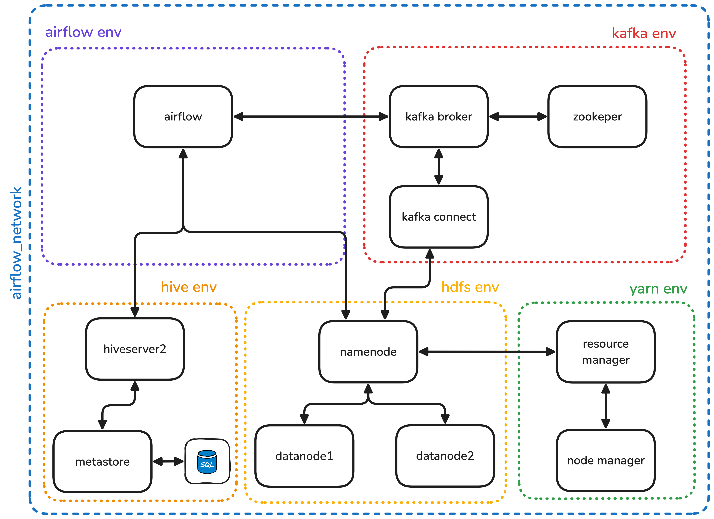

# 03 - Sensor Data Processing Pipeline with Airflow, Kafka, and Hive

By Adrián Romero Flores. Source code available at this [link](https://github.com/adrrf/bigdata/tree/main/03-airflow).

## Overview

1. [Introduction](#introduction)
2. [Setup and Configuration](#setup-and-configuration)
3. [Pipeline Architecture](#pipeline-architecture)
4. [Airflow DAG Implementation](#airflow-dag-implementation)
5. [Hive Queries and Analytics](#hive-queries-and-analytics)
6. [Results and Conclusions](#results-and-conclusions)

## Introduction

This project builds a comprehensive data processing pipeline for sensor data using Apache Airflow as the orchestration engine. The pipeline ingests temperature, humidity, and air quality readings from a CSV file, sends them to Kafka, persists the data in HDFS, and performs analytical queries using Hive.

The document structure is as follows, in section Setup and Configuration we will talk about the infrastructure setup and configuration. In section Pipeline we will describe the data pipeline architecture. In section Airflow DAG Implementation we will implement the Airflow DAGs for the pipeline. In section Hive Queries and Analytics we will talk about the Hive queries. In section Results and Conclusions we will summarize the results and draw conclusions.

## Setup and Configuration

We have used the sample code provided in [S4 - Airflow-Kafka](https://github.com/josemarialuna/ing-datos-big-data-US), and no major modifications were applied to the base setup.

The system is deployed on a single virtual network named airflow_network, enabling uninterrupted communication between all services.

The architecture is composed of five main environments:

- Kafka Environment: This layer handles the message streaming functionality. The core component is the Kafka broker, which manages the reception and distribution of messages. Kafka is orchestrated by ZooKeeper and integrated with Kafka Connect, which serves as a bridge to external systems such as HDFS. Additionally, a Kafka UI tool is included to facilitate monitoring of topics and messages (not in the diagram).

- HDFS Environment: This layer is responsible for distributed data storage. The main component is the NameNode, which manages the filesystem namespace and coordinates the two DataNodes where data blocks are physically stored. A web-based HDFS UI is also provided for file browsing and inspection.

- YARN Environment: This layer manages cluster resource allocation and job scheduling. The ResourceManager is the central component, responsible for assigning resources to running applications. It operates in conjunction with a NodeManager, which handle task execution on the worker nodes.

- Hive Environment: This layer provides a SQL-like interface for querying and managing data stored in HDFS. The main component is the Hive Metastore, which stores metadata about tables and partitions. Hive also includes a HiveServer2 component for executing queries and a Hive CLI for interactive querying. We use MySQL as the metastore database.

- Airflow Environment: This layer is responsible for orchestrating data pipelines. The main component is the Airflow scheduler, which manages the execution of DAGs. Airflow also includes a web-based UI for monitoring and managing DAGs.



To get the environment

1. Clone the repository:

   ```
   git clone https://github.com/josemarialuna/ing-datos-big-data-US
   ```

2. Navigate to the Airflow directory:

   ```
   cd ing-datos-big-data-US/03-airflow
   ```

3. Start the services:
   ```
   docker-compose up -d
   ```

## Pipeline Architecture

The data pipeline consists of the following steps, orchestrated by Airflow:


1. temperature_and_humidity.csv: A CSV file containing sensor readings (temperature, humidity, air quality) from various locations within a home.

2. Data Ingestion: Airflow reads the CSV file, transforms it into JSON messages, and sends them to a Kafka topic named "sensores".

3. Data Storage: A Kafka Connect HDFS Sink connector consumes the messages and writes them to HDFS.

4. Analytics: Several analytical Hive queries are performed on the data to extract insights.

## Airflow DAG Implementation

The Airflow DAG defines the workflow and dependencies between tasks. The main components of the DAG are:

1. Task Configuration: Sets up the Kafka-HDFS connector that moves data from Kafka to HDFS:

```python
def create_sink():
    logger.info(f"Creating Kafka-HDFS sink connector for topic '{KAFKA_TOPIC}'")
    connector_config = {
        "name": "hdfs-sink-connector",
        "config": {
            "connector.class": "io.confluent.connect.hdfs.HdfsSinkConnector",
            "tasks.max": "1",
            "topics": KAFKA_TOPIC,
            "hdfs.url": HDFS_URL,
            "flush.size": "10",
            "hdfs.authentication.kerberos": "false",
            "format.class": "io.confluent.connect.hdfs.json.JsonFormat",
            "partitioner.class": "io.confluent.connect.storage.partitioner.DefaultPartitioner",
            "rotate.interval.ms": "60000",
            "locale": "en",
            "timezone": "UTC",
            "value.converter.schemas.enable": "false",
        },
    }

    logger.info("Sending connector configuration to Kafka Connect")
    try:
        response = requests.post(
            "http://kafka-connect:8083/connectors",
            headers={"Content-Type": "application/json"},
            data=json.dumps(connector_config),
        )

        if response.status_code == 201:
            logger.info("Connector created successfully")
        else:
            if response.status_code == 409:
                logger.info(
                    "Connector already exists, continuing with existing connector"
                )
            else:
                logger.error(
                    f"Failed to create connector: Status code {response.status_code}"
                )
                logger.error(f"Error response: {response.text}")
    except Exception as e:
        logger.error(f"Exception when creating connector: {str(e)}", exc_info=True)
        raise

create_sink_task = PythonOperator(
    task_id="create_kafka_hdfs_sink",
    python_callable=create_sink,
    dag=dag,
)
```

2. Data Ingestion: Reads the CSV file, converts it to JSON, and sends the messages to Kafka.

```python
def csv_to_json(**kwargs):
    logger.info(f"Reading CSV file from {CSV_FILE_PATH}")
    try:
        dataset = pd.read_csv(CSV_FILE_PATH)
        logger.info(f"Read CSV with {len(dataset)} rows")

        dataset.rename(columns={"timestamp": "record_datetime"}, inplace=True)

        records = dataset.to_dict(orient="records")

        messages = [
            (f"record_{i}", json.dumps(record)) for i, record in enumerate(records)
        ]

        logger.info(
            f"Prepared {len(messages)} messages for Kafka topic '{KAFKA_TOPIC}'"
        )
        return messages
    except Exception as e:
        logger.error(f"Error processing CSV file: {str(e)}", exc_info=True)
        raise

json_to_kafka_task = ProduceToTopicOperator(
    task_id="publish_csv",
    topic=KAFKA_TOPIC,
    kafka_config_id="kafka_default",
    producer_function=csv_to_json,
    dag=dag,
)
```

3. Database and Table Creation: Creates a Hive database and table for storing the sensor data.

```python
def create_database():
    logger.info("Creating Hive database if it doesn't exist")
    try:
        hive_hook = HiveServer2Hook(hiveserver2_conn_id="hive_default")
        conn = hive_hook.get_conn()
        cursor = conn.cursor()

        cursor.execute("CREATE DATABASE IF NOT EXISTS sensors")

        cursor.close()
        conn.close()
        logger.info("Database created successfully")
    except Exception as e:
        logger.error(f"Error creating database: {str(e)}", exc_info=True)
        raise


def create_table():
    logger.info("Creating Hive table 'sensors.records'")
    try:
        hive_hook = HiveServer2Hook(hiveserver2_conn_id="hive_default")
        conn = hive_hook.get_conn()
        cursor = conn.cursor()

        cursor.execute("DROP TABLE IF EXISTS sensors.records")

        cursor.execute(f"""
            CREATE TABLE IF NOT EXISTS sensors.records (
                record_datetime DATE,
                temperature_salon FLOAT,
                humidity_salon FLOAT,
                air_salon FLOAT,
                temperature_chambre FLOAT,
                humidity_chambre FLOAT,
                air_chambre FLOAT,
                temperature_bureau FLOAT,
                humidity_bureau FLOAT,
                air_bureau FLOAT,
                temperature_exterieur FLOAT,
                humidity_exterieur FLOAT,
                air_exterieur FLOAT
            )
            ROW FORMAT SERDE 'org.apache.hive.hcatalog.data.JsonSerDe'
            STORED AS TEXTFILE
            LOCATION 'hdfs://namenode:9000{HDFS_SENSOR_PATH}'
        """)

        cursor.close()
        conn.close()
        logger.info("Table created successfully")
    except Exception as e:
        logger.error(f"Error creating table: {str(e)}", exc_info=True)
        raise

create_database_task = PythonOperator(
    task_id="create_database",
    python_callable=create_database,
    dag=dag,
)

create_table_task = PythonOperator(
    task_id="create_table",
    python_callable=create_table,
    dag=dag,
)
```

4. Analytics Tasks: Performs various analytical queries on the data (described in the next section).

The resulting DAG is as follows:

```python
(
    create_sink_task
    >> json_to_kafka_task
    >> create_database_task
    >> create_table_task
    >> query_avg_temp
    >> query_worst_air
    >> detect_humidity_task
)
```

## Hive Queries and Analytics

1. Average Temperature by Location and Day: This query calculates the average temperature for each location (salon, chambre, bureau, exterieur) grouped by day.

```sql
SELECT
    record_datetime,
    AVG(temperature_salon) AS avg_temperature_salon,
    AVG(temperature_chambre) AS avg_temperature_chambre,
    AVG(temperature_bureau) AS avg_temperature_bureau,
    AVG(temperature_exterieur) AS avg_temperature_exterieur
FROM sensors.records
GROUP BY record_datetime
```

The results are:
| datetime | salon | chambre | bureau | exterieur |
| ---------- | -------- | -------- | -------- | --------- |
| 2023-08-18 | 26.229 | 28.598 | 26.731 | 24.422 |
| 2023-08-19 | 28.050 | 29.841 | 28.428 | 25.369 |
| 2023-08-20 | 28.244 | 30.230 | 28.784 | 26.553 |
| 2023-08-21 | 28.858 | 31.425 | 29.564 | 26.902 |
| 2023-08-22 | 29.128 | 31.280 | 29.875 | 26.359 |
| 2023-08-23 | 28.582 | 30.892 | 29.533 | 25.216 |
| 2023-08-24 | 28.493 | 30.345 | 29.537 | 24.043 |
| 2023-08-25 | 27.586 | 29.723 | 28.939 | 22.695 |
| 2023-08-26 | 27.202 | 29.284 | 28.523 | 20.185 |
| 2023-08-27 | 24.550 | 27.476 | 26.213 | 17.748 |
| 2023-08-28 | 25.248 | 25.561 | 25.905 | 15.524 |

2. Worst Air Quality Readings: This query identifies the top 10 worst air quality measurements across all locations. We select the air quality of each location then unite all mid tables using `UNION ALL`.

```sql
SELECT
    record_datetime,
    'Salon' as location,
    air_salon as air_quality
FROM sensors.records

UNION ALL

SELECT
    record_datetime,
    'Chambre' as location,
    air_chambre as air_quality
FROM sensors.records

UNION ALL

SELECT
    record_datetime,
    'Bureau' as location,
    air_bureau as air_quality
FROM sensors.records

UNION ALL

SELECT
    record_datetime,
    'Exterieur' as location,
    air_exterieur as air_quality
FROM sensors.records

ORDER BY air_quality DESC
LIMIT 10
```

The results are:

| Date       | Location | Value  |
| ---------- | -------- | ------ |
| 2023-08-18 | Salon    | 2439.0 |
| 2023-08-18 | Salon    | 2389.0 |
| 2023-08-18 | Salon    | 2382.0 |
| 2023-08-18 | Salon    | 2375.0 |
| 2023-08-18 | Salon    | 2368.0 |
| 2023-08-18 | Salon    | 2342.0 |
| 2023-08-18 | Salon    | 2337.0 |
| 2023-08-18 | Salon    | 2314.0 |
| 2023-08-21 | Salon    | 2305.0 |
| 2023-08-21 | Salon    | 2288.0 |

3. Humidity Change Detection: This query detects changes in the humidity readings across all locations. We use `LAG(x,4)` to compare the current humidity with the 1 hour previous humidity. Like previously, we used also `UNION ALL` to combine the results from different locations.

```sql
WITH humidity_changes AS (
    SELECT
        record_datetime,
        humidity_salon,
        LAG(humidity_salon, 4) OVER (ORDER BY record_datetime) as prev_humidity_salon,
        humidity_chambre,
        LAG(humidity_chambre, 4) OVER (ORDER BY record_datetime) as prev_humidity_chambre,
        humidity_bureau,
        LAG(humidity_bureau, 4) OVER (ORDER BY record_datetime) as prev_humidity_bureau,
        humidity_exterieur,
        LAG(humidity_exterieur, 4) OVER (ORDER BY record_datetime) as prev_humidity_exterieur
    FROM sensors.records
)

SELECT
    record_datetime,
    'Salon' as location,
    humidity_salon as current_humidity,
    prev_humidity_salon as previous_humidity,
    ABS(humidity_salon - prev_humidity_salon) as humidity_change
FROM humidity_changes
WHERE ABS(humidity_salon - prev_humidity_salon) > 10
AND prev_humidity_salon IS NOT NULL

UNION ALL

SELECT
    record_datetime,
    'Chambre' as location,
    humidity_chambre as current_humidity,
    prev_humidity_chambre as previous_humidity,
    ABS(humidity_chambre - prev_humidity_chambre) as humidity_change
FROM humidity_changes
WHERE ABS(humidity_chambre - prev_humidity_chambre) > 10
AND prev_humidity_chambre IS NOT NULL

UNION ALL

SELECT
    record_datetime,
    'Bureau' as location,
    humidity_bureau as current_humidity,
    prev_humidity_bureau as previous_humidity,
    ABS(humidity_bureau - prev_humidity_bureau) as humidity_change
FROM humidity_changes
WHERE ABS(humidity_bureau - prev_humidity_bureau) > 10
AND prev_humidity_bureau IS NOT NULL

UNION ALL

SELECT
    record_datetime,
    'Exterieur' as location,
    humidity_exterieur as current_humidity,
    prev_humidity_exterieur as previous_humidity,
    ABS(humidity_exterieur - prev_humidity_exterieur) as humidity_change
FROM humidity_changes
WHERE ABS(humidity_exterieur - prev_humidity_exterieur) > 10
AND prev_humidity_exterieur IS NOT NULL

ORDER BY humidity_change DESC
```

The results are:

| Date       | Location  | Current    | Previous   | Change    |
| ---------- | --------- | ---------- | ---------- | --------- |
| 2023-09-10 | Exterieur | 79.5%      | 58.8125%   | 20.6875%  |
| 2023-08-29 | Exterieur | 82.5%      | 63.9375%   | 18.5625%  |
| 2023-09-10 | Exterieur | 79.25%     | 60.75%     | 18.5%     |
| 2023-08-29 | Exterieur | 63.9375%   | 80.9375%   | 17.0%     |
| 2023-09-10 | Exterieur | 78.375%    | 62.5%      | 15.875%   |
| 2023-08-18 | Exterieur | 72.375%    | 88.0%      | 15.625%   |
| 2023-08-18 | Exterieur | 74.25%     | 88.0%      | 13.75%    |
| 2023-09-10 | Exterieur | 77.5%      | 64.5625%   | 12.9375%  |
| 2023-08-26 | Exterieur | 81.5%      | 68.75%     | 12.75%    |
| 2023-08-30 | Exterieur | 73.625%    | 85.8125%   | 12.1875%  |
| 2023-09-10 | Exterieur | 60.8125%   | 72.9375%   | 12.125%   |
| 2023-08-18 | Exterieur | 100.0%     | 88.0%      | 12.0%     |
| 2023-08-24 | Exterieur | 68.5625%   | 57.4375%   | 11.125%   |
| 2023-08-24 | Exterieur | 71.25%     | 60.3125%   | 10.9375%  |
| 2023-08-30 | Exterieur | 77.125%    | 66.25%     | 10.875%   |
| 2023-08-24 | Exterieur | 73.9375%   | 63.1875%   | 10.75%    |
| 2023-09-10 | Exterieur | 71.5625%   | 60.8125%   | 10.75%    |
| 2023-08-24 | Exterieur | 76.625%    | 65.875%    | 10.75%    |
| 2023-08-30 | Exterieur | 74.6875%   | 64.125%    | 10.5625%  |
| 2023-08-24 | Exterieur | 79.125%    | 68.5625%   | 10.5625%  |
| 2023-08-30 | Exterieur | 62.0%      | 51.5%      | 10.5%     |
| 2023-09-09 | Exterieur | 60.671875% | 71.078125% | 10.40625% |
| 2023-09-10 | Exterieur | 74.0625%   | 63.6875%   | 10.375%   |
| 2023-08-24 | Exterieur | 81.625%    | 71.25%     | 10.375%   |
| 2023-09-09 | Exterieur | 63.296875% | 73.640625% | 10.34375% |
| 2023-08-30 | Exterieur | 59.375%    | 49.0625%   | 10.3125%  |
| 2023-09-08 | Exterieur | 62.90625%  | 73.21875%  | 10.3125%  |
| 2023-09-07 | Exterieur | 62.515625% | 72.796875% | 10.28125% |
| 2023-08-30 | Exterieur | 72.25%     | 62.0%      | 10.25%    |
| 2023-09-06 | Exterieur | 62.125%    | 72.375%    | 10.25%    |
| 2023-08-24 | Exterieur | 84.125%    | 73.9375%   | 10.1875%  |
| 2023-08-30 | Exterieur | 56.75%     | 46.625%    | 10.125%   |
| 2023-08-30 | Exterieur | 79.375%    | 69.25%     | 10.125%   |
| 2023-08-22 | Exterieur | 61.0625%   | 71.125%    | 10.0625%  |
| 2023-09-08 | Exterieur | 60.53125%  | 70.59375%  | 10.0625%  |
| **Total**  | 36        |            |            |           |

## Results and Conclusions

The pipeline successfully processes sensor data through the entire workflow, from ingestion to analysis. Each stage of the process is monitored through Airflow's web interface, allowing for easy tracking of task execution. Personally, i did not find any difficulty in setting up the pipeline. The tedious part was restarting every time the container to update the DAG, making the developer experience poor.

Below are the screenshots of the system in action:


