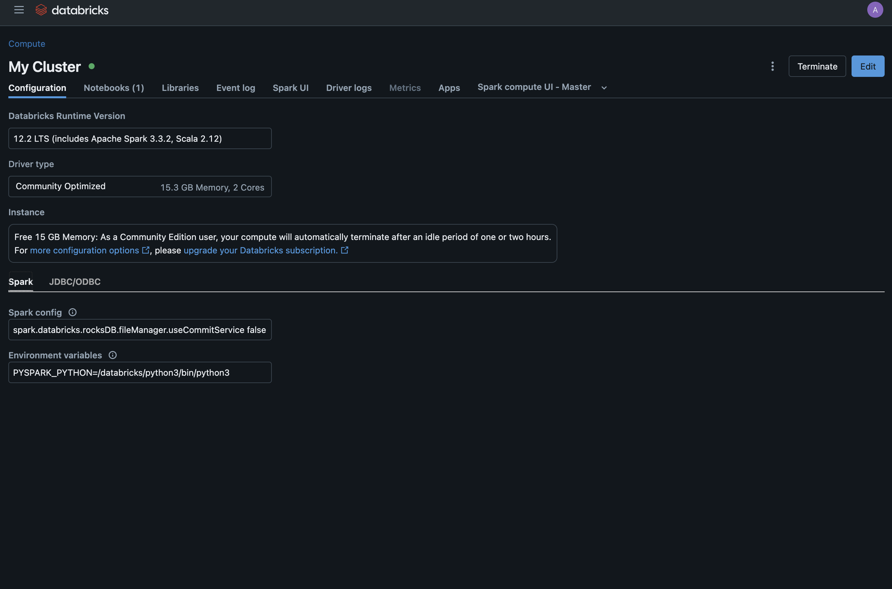
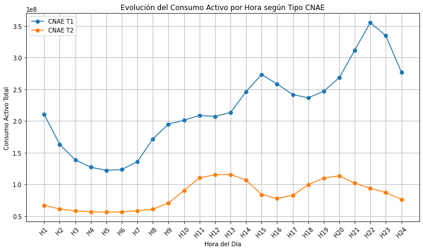
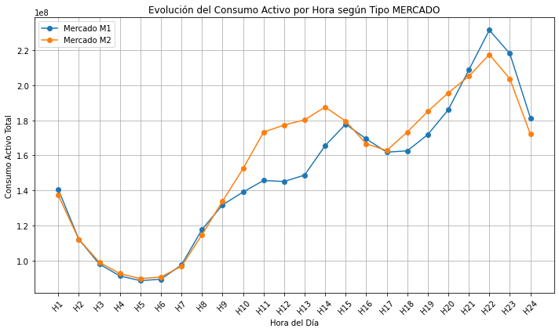
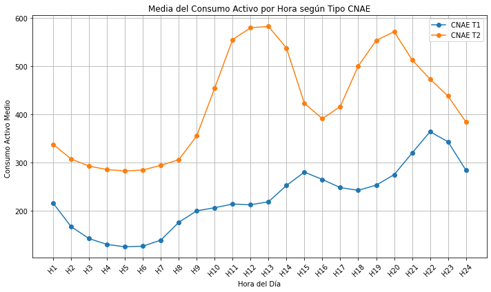
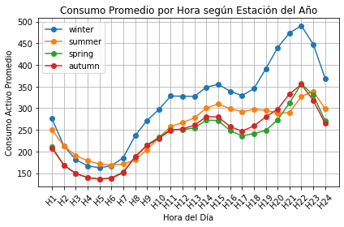
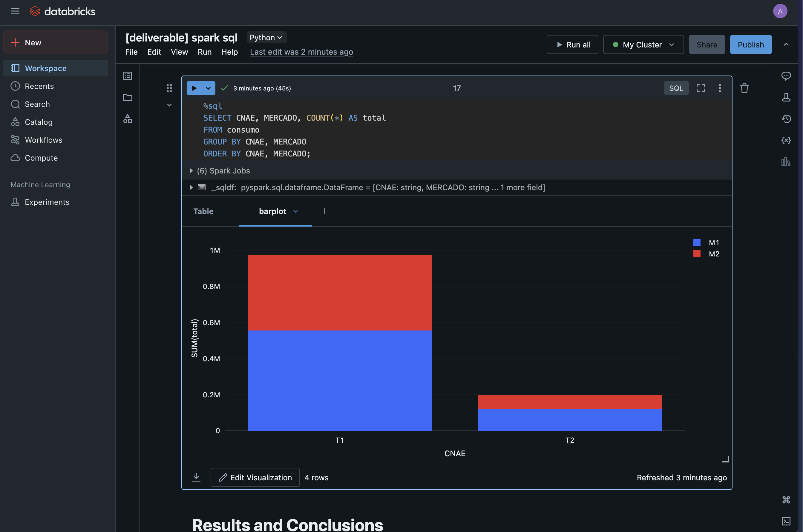

# 05 - Analyzing Electric Consumption Data with Spark SQL

**Author:** Adrián Romero Flores  
**Repository:** [link](https://github.com/adrrf/bigdata/tree/main/05-spark-sql)

Disclaimer: This document has been automatically generated from a Jupyter notebook and may contain formatting artifacts or code output inconsistencies. For the most accurate representation, refer to the original notebook in the repository.

---

## Overview

1. [Introduction](#introduction)  
2. [Environment Setup](#environment-setup)  
3. [Data Loading](#data-loading)  
4. [Data Analysis](#data-analysis)  
5. [Results and Conclusions](#results-and-conclusions)

## Introduction

This notebook demonstrates how to analyze electric consumption data using Spark SQL. The data is provided in CSV format and contains information about electric consumption in a specific region. The analysis will focus on understanding the consumption patterns and trends based on various factors such as type of consumer, and market type. The notebook will also explore the impact of seasons on energy consumption. 

The document structure is as follows, in section [Environment Setup](#environment-setup) we will talk about the execution environment. In section [Data Loading](#data-loading), we will load the data into a Spark DataFrame and perform some transformations. In section [Data Analysis](#data-analysis), we will perform certain queries to perform analysis in the data. Finally, in section [Results and Conclusions](#results-and-conclusions), we will summarize the results and provide conclusions based on the analysis.

## Environment Setup

For the execution of this notebook, we will use the DataBricks platform, which provides a cloud-based environment for running Spark applications. The notebook is written in Python and uses the PySpark library to interact with Spark. Here is a screenshot of the environment and the cluster details:


## Data Loading

First, we need to replicate the data loading and transformation steps from the previous notebook. We will load the data from a CSV file and perform some transformations.


```python
from pyspark.sql.types import StructType, StructField, StringType, DoubleType
# define the struct of types
schema = StructType([
    StructField("IDENTIFICADOR", StringType(), True),
    StructField("ANOMES", StringType(), True),
    StructField("CNAE", StringType(), True),
    StructField("PRODUCTO", StringType(), True),
    StructField("MERCADO", StringType(), True),
    StructField("ACTIVA_H1", DoubleType(), True),
    StructField("ACTIVA_H2", DoubleType(), True),
    StructField("ACTIVA_H3", DoubleType(), True),
    StructField("ACTIVA_H4", DoubleType(), True),
    StructField("ACTIVA_H5", DoubleType(), True),
    StructField("ACTIVA_H6", DoubleType(), True),
    StructField("ACTIVA_H7", DoubleType(), True),
    StructField("ACTIVA_H8", DoubleType(), True),
    StructField("ACTIVA_H9", DoubleType(), True),
    StructField("ACTIVA_H10", DoubleType(), True),
    StructField("ACTIVA_H11", DoubleType(), True),
    StructField("ACTIVA_H12", DoubleType(), True),
    StructField("ACTIVA_H13", DoubleType(), True),
    StructField("ACTIVA_H14", DoubleType(), True),
    StructField("ACTIVA_H15", DoubleType(), True),
    StructField("ACTIVA_H16", DoubleType(), True),
    StructField("ACTIVA_H17", DoubleType(), True),
    StructField("ACTIVA_H18", DoubleType(), True),
    StructField("ACTIVA_H19", DoubleType(), True),
    StructField("ACTIVA_H20", DoubleType(), True),
    StructField("ACTIVA_H21", DoubleType(), True),
    StructField("ACTIVA_H22", DoubleType(), True),
    StructField("ACTIVA_H23", DoubleType(), True),
    StructField("ACTIVA_H24", DoubleType(), True),
    StructField("ACTIVA_H25", DoubleType(), True),
    StructField("REACTIVA_H1", DoubleType(), True),
    StructField("REACTIVA_H2", DoubleType(), True),
    StructField("REACTIVA_H3", DoubleType(), True),
    StructField("REACTIVA_H4", DoubleType(), True),
    StructField("REACTIVA_H5", DoubleType(), True),
    StructField("REACTIVA_H6", DoubleType(), True),
    StructField("REACTIVA_H7", DoubleType(), True),
    StructField("REACTIVA_H8", DoubleType(), True),
    StructField("REACTIVA_H9", DoubleType(), True),
    StructField("REACTIVA_H10", DoubleType(), True),
    StructField("REACTIVA_H11", DoubleType(), True),
    StructField("REACTIVA_H12", DoubleType(), True),
    StructField("REACTIVA_H13", DoubleType(), True),
    StructField("REACTIVA_H14", DoubleType(), True),
    StructField("REACTIVA_H15", DoubleType(), True),
    StructField("REACTIVA_H16", DoubleType(), True),
    StructField("REACTIVA_H17", DoubleType(), True),
    StructField("REACTIVA_H18", DoubleType(), True),
    StructField("REACTIVA_H19", DoubleType(), True),
    StructField("REACTIVA_H20", DoubleType(), True),
    StructField("REACTIVA_H21", DoubleType(), True),
    StructField("REACTIVA_H22", DoubleType(), True),
    StructField("REACTIVA_H23", DoubleType(), True),
    StructField("REACTIVA_H24", DoubleType(), True),
    StructField("REACTIVA_H25", DoubleType(), True)
])
# read csv without header
df = spark.read.csv("/FileStore/tables/endesaAgregada.csv", header=False, schema=schema)
```


```python
# let's remove the ACTIVA_H25 column
df = df.drop("ACTIVA_H25")
# let's remove all REACTIVA_HX columns
reactiva_columns = [f"REACTIVA_H{i}" for i in range(1, 25)]

df = df.drop(*reactiva_columns)
print(f"columns after removal: {len(df.columns)} columns")
```

    columns after removal: 30 columns


```python
activa_columns = [f"ACTIVA_H{i}" for i in range(1, 25)]
df_negatives = df.filter(
    " OR ".join([f"{columna} < 0" for columna in activa_columns])
)
print(f"number of rows with negative values: {df_negatives.count()}")
df = df.subtract(df_negatives)
```

    number of rows with negative values: 4


## Data Analysis

For the analysis, we will use Spark SQL to perform various queries on the data. First, we will use the DF API to perform some queries. This API is not typed as we are using Python.

The following queries will be performed:

1. **Aggregated consumption per hour grouped CNAE**.
2. **Aggregated consumption per hour grouped by market type**.

For both queries, we will use the `groupBy` method to group the data by the specified columns and then use the `agg` method to perform the aggregation. We will also use the `matplotlib` library to plot the data. 


```python
from pyspark.sql.functions import sum as _sum
import matplotlib.pyplot as plt

activa_columns = [f"ACTIVA_H{i}" for i in range(1, 25)]
agg_cnae = df.groupBy("CNAE").agg(*[_sum(col).alias(col) for col in activa_columns])

agg_cnae_pd = agg_cnae.toPandas()
agg_cnae_pd.set_index("CNAE", inplace=True)
agg_cnae_pd = agg_cnae_pd.transpose()
agg_cnae_pd.index = [f"H{i}" for i in range(1, 25)]

plt.figure(figsize=(10, 6))
for cnae_type in agg_cnae_pd.columns:
    plt.plot(agg_cnae_pd.index, agg_cnae_pd[cnae_type], marker='o', label=f'CNAE {cnae_type}')

plt.title("Evolución del Consumo Activo por Hora según Tipo CNAE")
plt.xlabel("Hora del Día")
plt.ylabel("Consumo Activo Total")
plt.legend()
plt.grid(True)
plt.xticks(rotation=45)
plt.tight_layout()
plt.show()
```


    

    


The visualization of aggregated hourly consumption segmented by CNAE, reveals discernible trends and consumption patterns. In the case of CNAE, the profile `T1` demonstrates a consumption pattern typical of residential or human usage: minimal activity during nocturnal hours, with notable increases during the late afternoon and evening—corresponding with common periods of occupancy and usage. Conversely, the `T2` profile reflects a pattern indicative of industrial or commercial activity, characterized by a peak in the morning hours followed by a significant decline during midday, aligning with standard lunch breaks.


```python
agg_mercado = df.groupBy("MERCADO").agg(*[_sum(col).alias(col) for col in activa_columns])

agg_mercado_pd = agg_mercado.toPandas()
agg_mercado_pd.set_index("MERCADO", inplace=True)
agg_mercado_pd = agg_mercado_pd.transpose()
agg_mercado_pd.index = [f"H{i}" for i in range(1, 25)]

plt.figure(figsize=(10, 6))
for cnae_type in agg_mercado_pd.columns:
    plt.plot(agg_mercado_pd.index, agg_mercado_pd[cnae_type], marker='o', label=f'Mercado {cnae_type}')

plt.title("Evolución del Consumo Activo por Hora según Tipo MERCADO")
plt.xlabel("Hora del Día")
plt.ylabel("Consumo Activo Total")
plt.legend()
plt.grid(True)
plt.xticks(rotation=45)
plt.tight_layout()
plt.show()
```


    

    


This visualization also show an interesting phenomenon: Both profiles show similar trends, but the `M2` profile exhibits a marked increase in consumption during the working hours. This pattern suggests that this profile is likely associated with commercial or industrial activities. 

For the following queries, we will use the `sql` method to execute SQL queries directly on a temporary view created from the DataFrame. The SQL queries will be executed using the `spark.sql` method, and the results will be displayed using the `matplotlib` library. We use the `createOrReplaceTempView` method to create the temporary view, which allows us to execute SQL queries on the DataFrame as if it were a table in a database.


```python
df.createOrReplaceTempView("consumo")
```

The following queries will be performed:
1. **Average consumption per hour grouped by CNAE**.
2. **Top 10 consumers**.

For the first query we will use the `AVG` function to calculate the average consumption per hour grouped by CNAE using `GROUP BY` function. We will also use the `ORDER BY` clause to sort the results by the average consumption in descending order. The results will be displayed using the `matplotlib` library.


```python
avg_cnae = spark.sql("""
SELECT CNAE,
  AVG(ACTIVA_H1) AS H1,  AVG(ACTIVA_H2) AS H2,  AVG(ACTIVA_H3) AS H3,
  AVG(ACTIVA_H4) AS H4,  AVG(ACTIVA_H5) AS H5,  AVG(ACTIVA_H6) AS H6,
  AVG(ACTIVA_H7) AS H7,  AVG(ACTIVA_H8) AS H8,  AVG(ACTIVA_H9) AS H9,
  AVG(ACTIVA_H10) AS H10, AVG(ACTIVA_H11) AS H11, AVG(ACTIVA_H12) AS H12,
  AVG(ACTIVA_H13) AS H13, AVG(ACTIVA_H14) AS H14, AVG(ACTIVA_H15) AS H15,
  AVG(ACTIVA_H16) AS H16, AVG(ACTIVA_H17) AS H17, AVG(ACTIVA_H18) AS H18,
  AVG(ACTIVA_H19) AS H19, AVG(ACTIVA_H20) AS H20, AVG(ACTIVA_H21) AS H21,
  AVG(ACTIVA_H22) AS H22, AVG(ACTIVA_H23) AS H23, AVG(ACTIVA_H24) AS H24
FROM consumo
GROUP BY CNAE
ORDER BY CNAE
""")
```


```python
df_avg_cnae = avg_cnae.toPandas()
df_avg_cnae.set_index("CNAE", inplace=True)
df_avg_cnae = df_avg_cnae.transpose()
df_avg_cnae.index = [f"H{i}" for i in range(1, 25)]

plt.figure(figsize=(10, 6))
for col in df_avg_cnae.columns:
    plt.plot(df_avg_cnae.index, df_avg_cnae[col], marker='o', label=f"CNAE {col}")

plt.title("Media del Consumo Activo por Hora según Tipo CNAE")
plt.xlabel("Hora del Día")
plt.ylabel("Consumo Activo Medio ")
plt.grid(True)
plt.legend()
plt.xticks(rotation=45)
plt.tight_layout()
plt.show()
```


    

    


 In the case, the profile `T2` further demonstrates a consumption pattern typical of industrial or commercial activity, characterized by a peak in the morning hours followed by a significant decline during midday, aligning with standard lunch breaks. This visualization also shows that this profile, consumption is higher than the `T1` profile, which is typical of residential or human usage. The `T1` profile shows a consumption pattern typical of residential or human usage: minimal activity during nocturnal hours, with notable increases during the late afternoon and evening—corresponding with common periods of occupancy and usage.

The second query will use the `SUM` function to calculate the total consumption grouped by ID using `GROUP BY` function. We will also use the `ORDER BY` clause to sort the results by the total consumption in descending order, and the `LIMIT` clause to limit the results to the top 10 consumers.


```python
top_10_consumers = spark.sql("""
SELECT IDENTIFICADOR,
  SUM(
    ACTIVA_H1 + ACTIVA_H2 + ACTIVA_H3 + ACTIVA_H4 + ACTIVA_H5 + ACTIVA_H6 +
    ACTIVA_H7 + ACTIVA_H8 + ACTIVA_H9 + ACTIVA_H10 + ACTIVA_H11 + ACTIVA_H12 +
    ACTIVA_H13 + ACTIVA_H14 + ACTIVA_H15 + ACTIVA_H16 + ACTIVA_H17 + ACTIVA_H18 +
    ACTIVA_H19 + ACTIVA_H20 + ACTIVA_H21 + ACTIVA_H22 + ACTIVA_H23 + ACTIVA_H24
  ) AS TOTAL
FROM consumo
GROUP BY IDENTIFICADOR
ORDER BY TOTAL DESC
LIMIT 10
""")
top_10_consumers.show()
```

| IDENTIFICADOR |    TOTAL   |
|--------------|-------------|
|     15455    | 4260686.5   |
|     14181    | 3720379.5   |
|     16941    | 3645076.0   |
|     11411    | 3214868.5   |
|     10618    | 3174944.0   |
|     13009    | 3158501.5   |
|     13232    | 3136844.5   |
|     11656    | 3070493.0   |
|     11218    | 2992956.5   |
|     10916    | 2935226.0   |


Now, we will use the `udf` method to create a user-defined function (UDF) to calculate the average consumption per season. The UDF will be applied to the DataFrame using the `withColumn` method. The UDF will take the year and month as integer input and return the corresponding season. The seasons are defined as follows:

- Winter: December, January, February
- Spring: March, April, May
- Summer: June, July, August
- Autumn: September, October, November

The results will be displayed using the `matplotlib` library.


```python
from pyspark.sql.functions import udf
from pyspark.sql.types import StringType

def get_season(ano_mes: int) -> str:
    mes = int(str(ano_mes)[-2:])
    if mes in [12, 1, 2]:
        return "winter"
    elif mes in [3, 4, 5]:
        return "spring"
    elif mes in [6, 7, 8]:
        return "summer"
    elif mes in [9, 10, 11]:
        return "autumn"
    else:
        return "unkown"
    
season_udf = udf(get_season, StringType())
df = df.withColumn("SEASON", season_udf(df["ANOMES"]))
```


```python
from pyspark.sql.functions import avg

avg_season = df.groupBy("SEASON").agg(
    *[avg(col).alias(col) for col in activa_columns]
)

avg_season_pd = avg_season.toPandas()
avg_season_pd.set_index("SEASON", inplace=True)
avg_season_pd = avg_season_pd.transpose()
avg_season_pd.index = [f"H{i}" for i in range(1, 25)]

for season in avg_season_pd.columns:
    plt.plot(avg_season_pd.index, avg_season_pd[season], marker='o', label=season)

plt.title("Consumo Promedio por Hora según Estación del Año")
plt.xlabel("Hora del Día")
plt.ylabel("Consumo Activo Promedio")
plt.legend()
plt.grid(True)
plt.xticks(rotation=45)
plt.tight_layout()
plt.show()
```


    

    


Visualizing this graph we can appreciate that winter is the season with the highest consumption, followed by summer, autumn and spring. The winter season is characterized by the highest consumption with an significantly bigger increase during the night hours, likely due to increased heating and lighting needs. The summer season shows a similar pattern, but with a smaller increase during the afternoon, likely due to increased cooling needs. The autumn and spring seasons show a similar pattern, but with lower consumption levels overall.

Finally, we can use in Databricks the `%sql` magic command to execute SQL queries directly in the notebook. This allows us to execute SQL queries direcly. The results will be displayed in a table format and we can use the built-in visualization tools to create charts and graphs. For example, we perform a query to count the number of consumers per CNAE and market type. The results will be displayed in a table format and we can use the built-in visualization tools to create charts and graphs. We can also use the `display` method to display the results in a table format.



```python
%sql 
SELECT CNAE, MERCADO, COUNT(*) AS total
FROM consumo
GROUP BY CNAE, MERCADO
ORDER BY CNAE, MERCADO;
```

| CNAE | MERCADO | total   |
|------|---------|---------|
| T1   | M1      | 556046  |
| T1   | M2      | 418756  |
| T2   | M1      | 121578  |
| T2   | M2      | 76985   |


## Results and Conclusions

In conclusion, the analysis of the electric consumption data provided valuable insights into consumption patterns and trends. These findings can be used to optimize energy usage, identify potential areas for improvement, and make informed decisions regarding energy management.

The visualizations of hourly consumption segmented by CNAE and market type revealed discernible trends and consumption patterns, indicating variations in usage based on the nature of the consumer. The analysis also highlighted the impact of seasons on energy consumption, with winter and summer seasons showing higher consumption levels compared to spring and autumn.

Furthermore, the analysis of the top 10 consumers provided insights into the highest energy-consuming entities, which can be useful for targeted energy management strategies and identifying potential areas for energy efficiency improvements.
