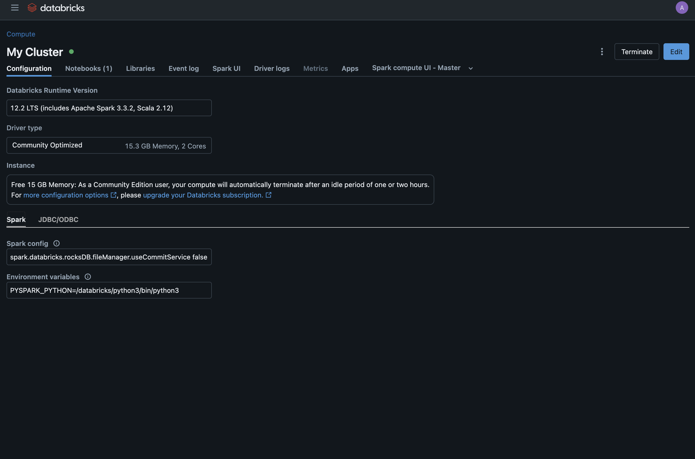

# 06 - Predicting Electric Consumption Data with Spark ML-Lib

**Author:** Adrián Romero Flores  
**Repository:** [link](https://github.com/adrrf/bigdata/tree/main/05-spark-sql)

Disclaimer: This document has been automatically generated from a Jupyter notebook and may contain formatting artifacts or code output inconsistencies. For the most accurate representation, refer to the original notebook in the repository.

---

## Overview

1. [Introduction](#introduction)  
2. [Environment Setup](#environment-setup)  
3. [Data Loading](#data-loading)  
4. [Unsupervised Learning](#unsupervised-learning)  
5. [Supervised Learning](#supervised-learning)  
6. [Results and Conclusions](#results-and-conclusions)

## Introduction

This notebook demonstrates how to analyze electric consumption data using Spark SQL. The data is provided in CSV format and contains information about electric consumption in a specific region. The analysis will focus on understanding the consumption patterns and trends based on various factors such as type of consumer, and market type. The notebook will also explore the impact of seasons on energy consumption. 

The document structure is as follows, in section [Environment Setup](#environment-setup) we will talk about the execution environment. In section [Data Loading](#data-loading), we will load the data into a Spark DataFrame and perform some transformations. In section [Unsupervised Learning](#unsupervised-learning) and [Unsupervised Learning](#unsupervised-learning), we will use machine learning algorithes to get models. Finally, in section [Results and Conclusions](#results-and-conclusions), we will summarize the results.

## Environment Setup

For the execution of this notebook, we will use the DataBricks platform, which provides a cloud-based environment for running Spark applications. The notebook is written in Python and uses the PySpark library to interact with Spark. Here is a screenshot of the environment and the cluster details:


## Data Loading

First, we need to replicate the data loading and transformation steps from the previous notebook. We will load the data from a CSV file and perform some transformations.


```python
from pyspark.sql.types import StructType, StructField, StringType, DoubleType
# define the struct of types
schema = StructType([
    StructField("IDENTIFICADOR", StringType(), True),
    StructField("ANOMES", StringType(), True),
    StructField("CNAE", StringType(), True),
    StructField("PRODUCTO", StringType(), True),
    StructField("MERCADO", StringType(), True),
    StructField("ACTIVA_H1", DoubleType(), True),
    StructField("ACTIVA_H2", DoubleType(), True),
    StructField("ACTIVA_H3", DoubleType(), True),
    StructField("ACTIVA_H4", DoubleType(), True),
    StructField("ACTIVA_H5", DoubleType(), True),
    StructField("ACTIVA_H6", DoubleType(), True),
    StructField("ACTIVA_H7", DoubleType(), True),
    StructField("ACTIVA_H8", DoubleType(), True),
    StructField("ACTIVA_H9", DoubleType(), True),
    StructField("ACTIVA_H10", DoubleType(), True),
    StructField("ACTIVA_H11", DoubleType(), True),
    StructField("ACTIVA_H12", DoubleType(), True),
    StructField("ACTIVA_H13", DoubleType(), True),
    StructField("ACTIVA_H14", DoubleType(), True),
    StructField("ACTIVA_H15", DoubleType(), True),
    StructField("ACTIVA_H16", DoubleType(), True),
    StructField("ACTIVA_H17", DoubleType(), True),
    StructField("ACTIVA_H18", DoubleType(), True),
    StructField("ACTIVA_H19", DoubleType(), True),
    StructField("ACTIVA_H20", DoubleType(), True),
    StructField("ACTIVA_H21", DoubleType(), True),
    StructField("ACTIVA_H22", DoubleType(), True),
    StructField("ACTIVA_H23", DoubleType(), True),
    StructField("ACTIVA_H24", DoubleType(), True),
    StructField("ACTIVA_H25", DoubleType(), True),
    StructField("REACTIVA_H1", DoubleType(), True),
    StructField("REACTIVA_H2", DoubleType(), True),
    StructField("REACTIVA_H3", DoubleType(), True),
    StructField("REACTIVA_H4", DoubleType(), True),
    StructField("REACTIVA_H5", DoubleType(), True),
    StructField("REACTIVA_H6", DoubleType(), True),
    StructField("REACTIVA_H7", DoubleType(), True),
    StructField("REACTIVA_H8", DoubleType(), True),
    StructField("REACTIVA_H9", DoubleType(), True),
    StructField("REACTIVA_H10", DoubleType(), True),
    StructField("REACTIVA_H11", DoubleType(), True),
    StructField("REACTIVA_H12", DoubleType(), True),
    StructField("REACTIVA_H13", DoubleType(), True),
    StructField("REACTIVA_H14", DoubleType(), True),
    StructField("REACTIVA_H15", DoubleType(), True),
    StructField("REACTIVA_H16", DoubleType(), True),
    StructField("REACTIVA_H17", DoubleType(), True),
    StructField("REACTIVA_H18", DoubleType(), True),
    StructField("REACTIVA_H19", DoubleType(), True),
    StructField("REACTIVA_H20", DoubleType(), True),
    StructField("REACTIVA_H21", DoubleType(), True),
    StructField("REACTIVA_H22", DoubleType(), True),
    StructField("REACTIVA_H23", DoubleType(), True),
    StructField("REACTIVA_H24", DoubleType(), True),
    StructField("REACTIVA_H25", DoubleType(), True)
])
# read csv without header
df = spark.read.csv("/FileStore/tables/endesaAgregada.csv", header=False, schema=schema)
```


```python
# let's remove the ACTIVA_H25 column
df = df.drop("ACTIVA_H25")
# let's remove all REACTIVA_HX columns
reactiva_columns = [f"REACTIVA_H{i}" for i in range(1, 25)]

df = df.drop(*reactiva_columns)
print(f"columns after removal: {len(df.columns)} columns")
```

    columns after removal: 30 columns


```python
activa_columns = [f"ACTIVA_H{i}" for i in range(1, 25)]
df_negatives = df.filter(
    " OR ".join([f"{columna} < 0" for columna in activa_columns])
)
print(f"number of rows with negative values: {df_negatives.count()}")
df = df.subtract(df_negatives)
```

    number of rows with negative values: 4


## Unsupervised Learning

In this section, we will use unsupervised learning techniques to analyze the electric consumption data. We will use clustering algorithms to group similar consumption patterns and identify trends. 

First, we will index the categorical columns to convert them into numerical values. We will use the `StringIndexer` to index the categorical columns. We will also use the `VectorAssembler` to combine the features into a single vector column. 


```python
from pyspark.ml.feature import StringIndexer, VectorAssembler

indexers = [
    StringIndexer(inputCol="CNAE", outputCol="CNAE_index"),
    StringIndexer(inputCol="MERCADO", outputCol="MERCADO_index")
]

features = [f"ACTIVA_H{i}" for i in range(1, 25)] + ["CNAE_index", "MERCADO_index"]
assembler = VectorAssembler(inputCols=features, outputCol="features")
```

For the clustering, we will use the `KMeans` algorithm. We have built a `Pipeline` to streamline the process of transforming the data and applying the clustering algorithm. The pipeline will include the following steps:

1. Indexing the categorical columns
2. Assembling the features into a single vector column
3. Applying the KMeans algorithm

We will select the number of clusters based on the elbow method. The elbow method is a heuristic used in cluster analysis to determine the number of clusters in a dataset. It works by plotting the explained variation as a function of the number of clusters and selecting the "elbow" point where the rate of decrease sharply changes.


```python
from pyspark.ml.clustering import KMeans
from pyspark.ml import Pipeline

costs = []
for k in range(2, 11):
    print("try k = ", k)
    kmeans = KMeans(featuresCol="features", k=k)
    pipeline = Pipeline(stages=indexers + [assembler, kmeans])
    model = pipeline.fit(df)
    wssse = model.stages[-1].summary.trainingCost
    costs.append((k, wssse))
```

```python
import matplotlib.pyplot as plt

ks, wssses = zip(*costs)

plt.figure(figsize=(8, 5))
plt.plot(ks, wssses, marker='o')
plt.title("Método del Codo")
plt.xlabel("K")
plt.ylabel("WSSSE")
plt.grid(True)
plt.xticks(ks)
plt.tight_layout()
plt.show()
```


    

    


We have chosen the number of clusters as 3, as it is the number of clusters found at the elbow of the graph.


```python
kmeans = KMeans(featuresCol="features", k=3)
pipeline = Pipeline(stages=indexers + [assembler, kmeans])
model = pipeline.fit(df)
kmeans_model = model.stages[-1]
```

Now to see the results of the clustering, we will use the `transform` method of the pipeline to apply the transformations and clustering to the data. Then we will get the centroids of the clusters in order to analyze the cluster details.  


```python
df_clustered = model.transform(df)
```


```python
import pandas as pd
import numpy as np

centers = kmeans_model.clusterCenters()
columns = assembler.getInputCols()
centroids_df = pd.DataFrame(centers, columns=columns)
centroids_df.index.name = 'Cluster'
centroids_df
```

| Cluster | H1 | H2 | H3 | H4  | ... | CNAE | MERCADO |
|---------|-----------|-----------|-----------|-----------|-----------|-----------|------------|--------------|
| 0       | 166.98    | 130.35    | 112.27    | 103.80       | ...   | 0.15       | 0.41         |
| 1       | 5157.81   | 4831.96   | 4642.15   | 4505.19    | ...  | 0.84       | 0.75         |
| 2       | 848.24    | 702.61    | 622.49    | 581.99      | ...    | 0.40       | 0.53         |


The clustering analysis reveals interesting patterns in the electric consumption data. The first cluster represents a group of customers with low consumption levels, predominantly consisting of domestic customers. In contrast, the second cluster comprises customers with high consumption levels, primarily industrial customers. The third cluster represents a group of customers with moderate consumption levels, mainly consisting of domestic commercial customers.

## Supervised Learning

In this section, we will use supervised learning techniques to predict electric consumption based on various features. We will use the classification algorithms to predict the type of consumer based on the consumption data.

As in the previous section, we will use the `StringIndexer` to index the categorical columns and the `VectorAssembler` to combine the features into a single vector column. We will also apply the `Pipeline` directly to the data.


```python
indexer = StringIndexer(inputCol="CNAE", outputCol="label")

features = [f"ACTIVA_H{i}" for i in range(1, 25)]

assembler = VectorAssembler(inputCols=features, outputCol="features")

pipeline_prep = Pipeline(stages=[indexer, assembler])

df_prepared = pipeline_prep.fit(df).transform(df)
```

We will also split the data into training and test sets. The training set will be used to train the model, while the test set will be used to evaluate the model's performance.


```python
train, test = df_prepared.randomSplit([0.8, 0.2], seed=33)
```

We will test several classification algorithms, including Logistic Regression, Decision Trees, Random Forests, and Gradient-Boosted Trees. We will evaluate the models using `F1-score` as the metric. For evaluating the models, we will use the `MulticlassClassificationEvaluator` to calculate the F1-score for each model. The F1-score is a measure of a model's accuracy that considers both precision and recall. It is particularly useful for imbalanced datasets, where one class may be more prevalent than others.


```python
from pyspark.ml.classification import (
    RandomForestClassifier,
    GBTClassifier,
    LogisticRegression,
    DecisionTreeClassifier
)
from pyspark.ml.evaluation import MulticlassClassificationEvaluator

evaluator = MulticlassClassificationEvaluator(
    labelCol="label", predictionCol="prediction", metricName="f1")

models = {
    "RandomForest": RandomForestClassifier(labelCol="label", featuresCol="features", numTrees=50),
    "GBT": GBTClassifier(labelCol="label", featuresCol="features", maxIter=50),
    "DecisionTree": DecisionTreeClassifier(labelCol="label", featuresCol="features"),
    "LogisticRegression": LogisticRegression(labelCol="label", featuresCol="features", maxIter=100)
}

results = {}

for name, classifier in models.items():
    model = classifier.fit(train)
    predictions = model.transform(test)
    f1 = evaluator.evaluate(predictions)
    results[name] = f1
    print(f"{name}: F1 score = {f1:.4f}")

```

    RandomForest: F1 score = 0.8090
    GBT: F1 score = 0.8542
    DecisionTree: F1 score = 0.8361
    LogisticRegression: F1 score = 0.8056


The results of the classification algorithms show that the gradient-boosted tree classifier performed the best, achieving an F1-score of 0.85. To get more details about the model, we will use the `featureImportances` attribute of the model to get the feature importances. The feature importances indicate the relative importance of each feature in making predictions.


```python
gbt = GBTClassifier(labelCol="label", featuresCol="features", maxIter=50)
model = gbt.fit(train)

importances = model.featureImportances.toArray()
feature_names = assembler.getInputCols()

feature_importance = list(zip(feature_names, importances))

for name, score in sorted(feature_importance, key=lambda x: x[1], reverse=True):
    print(f"{name}: {score:.4f}")
```

    ACTIVA_H12: 0.1230
    ACTIVA_H23: 0.1042
    ACTIVA_H13: 0.1006
    ACTIVA_H24: 0.0947
    ACTIVA_H16: 0.0800
    ACTIVA_H22: 0.0672
    ACTIVA_H5: 0.0542
    ACTIVA_H6: 0.0530
    ACTIVA_H7: 0.0527
    ACTIVA_H19: 0.0365
    ACTIVA_H8: 0.0345
    ACTIVA_H2: 0.0258
    ACTIVA_H20: 0.0244
    ACTIVA_H11: 0.0230
    ACTIVA_H15: 0.0222
    ACTIVA_H4: 0.0165
    ACTIVA_H10: 0.0146
    ACTIVA_H9: 0.0144
    ACTIVA_H21: 0.0128
    ACTIVA_H17: 0.0125
    ACTIVA_H1: 0.0124
    ACTIVA_H3: 0.0094
    ACTIVA_H18: 0.0072
    ACTIVA_H14: 0.0043


The feature importances indicate that the most important features for predicting the type of consumer are `ACTIVA_H12`, `ACTIVA_H23`, and `ACTIVA_H13`. The energy consumption during these hours is crucial for determining the type of consumer, as they refletp the peak consumption hours for each type of consumer.

## Results and Conclusions

In conclusion, the analysis of electric consumption data using Spark ML-Lib has provided valuable insights into the consumption patterns and trends. The clustering analysis revealed distinct groups of customers based on their consumption levels, while the supervised learning analysis demonstrated the effectiveness of various classification algorithms in predicting the type of consumer based on consumption data.
